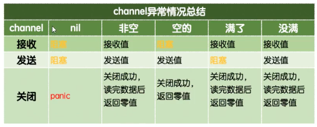

#  变量类型

## 整形

```go
var x int32 = 10
var x = int32(10)
x := int32(10)
```


## 字符串

Go语言中字符串是用双引号包裹的！！！

Go语言中单引号包裹的的是字符！！！

1. ```go
   s := "hello 沙河"
   // 单独的字母、汉字、符号
   c1 := 'h'
   c2 := '1'
   c3 := '沙'
   一个utf8编码的汉字一般占3个字节
   ```

2. ```go
   s2 := `
   	稍等哈
   	要吃饭
   `
   原样输出不转义
   ```

3. ```go
   len(s)
   name + word || sprintf()
   strings.Split(s, "\\")  // 分割
   strings.contains(s, "张帅") // 包含
   strings.HasPrefix || strings.HasSuffix
   strings.Index || strings.LastIndex
   strings.Join(s, "\\")
   ```

字符类型

1. uint8类型
2. runo类型，非ascii类型

## 数组

数组是值类型。定长

数组定义：

1. ```go
   s = [3]int
   ```

2. ```go
   s = [...]int{2, 3, 4}
   ```

## 切片[slice]

可变长度，切片是引用类型。

切片定义：

1. ```go
   s = []int{1, 2, 3}
   ```

2. ```
   s = make([]int, 3, 3)
   ```

3. ```
   s1 = [3]int
   s = s1[:]
   ```

切片方法：

1. ```go
   len() 长度
   切片的长度就是它元素的个数。
   ```

2. ```go
   cap() 容量
   切片的容量是从数组切片的第一个元素到最后一个元素的长度。
   ```

3. ```go
   append() 追加
   调用append函数必须用原来的切片变量接收返回值。
   1. 扩容：返回新的底层数组。
   2. 不扩容：修改底层数组。
   ```

4. ```go
   copy() 拷贝
   ```

5. ```go
   ... 表示把切片拆开
   s1 = append(s1, s2...)
   ```

### 切片的本质

切片就是一个框，框住了一块儿连续的内存。属于引用类型。

切片指向了一个底层的数组。

## 指针

Go语言中不存在指针操作，只需要记住两个符号：

1. `&`：取地址
2. `*`：根据地址取值

指针定义：

```go
s = new(int)
```

### Make 和 new 的区别

1. 都是用来申请内存的。
2. new很少用，一般用来给基本数据类型申请内存，返回对应类型的指针。
3. make用来给`slice`，`map`，`chan`申请内存，返回的是对应的这三个类型本身。

## map

map定义

```go
var m map[string]int
m = make(map[string]int, 10)  // 尽量避免动态扩容
```

map方法

1. ```go
   // 删除不报错
   delete(m, '123')
   ```

### 元素类型为map的切片

```go
s = make([]map[int]string, 10, 10)
s[0] = make(map[int]string, 1)
```

### 值为切片类型的map

```go
s = make(map[int][]string, 10)
s["123"] = make([]int, 10, 10)
```


# 遍历

```go
for i := 0; i < len(s); i++ {
  fmt.PrintIn(s[i])
}

for i, v := range s {
  fmt.PrintIn(i, v)
}
```

# 函数

1. defer：多用于释放资源

   1. 把语句延迟到函数即将返回时在执行。

   2. 多个defer按照栈的方式执行。

   3. ```tex
      return 分为两步
      1. 返回值赋值
      2. 真正返回。
      3. defer在两步之间
      ```

## 作用域

1. 全局作用域
2. 函数作用域
3. 块作用域：for
4. Go语言中如果标识符首字母是大写的，就表示对外部包可见。

## 函数类型

1. 函数作为参数：x func() int
2. 函数还可以作为返回值：x func() int

## 闭包

闭包 = 函数 + 外部变量的引用

## 内置函数

1. ```go
   len
   ```

2. ```go
   new 用来分配值内存，返回指针
   ```

3. ```go
   make 用来分配引用类型，返回chan、map、slice
   ```

4. ```go
   append 向数组追加元素，slice
   ```

5. ```go
   panic/recover  用来做错误处理，成对出现
   func funcA() {
     defer func() {
       err := recover() // 解除崩溃
     }()
     panic("出错了！！")// 程序崩溃退出
   }
   1. recover 必须和 panic 成对使用。
   2. defer 要在 panic 之前定义。
   ```

# 结构体

值类型

## 定义

```go
type 类型名 struct {
  字段名 字段类型
  字段名 字段类型
  ...
}
```

## 类型别名和自定义类型

```go
// 自定义类型
type myInt int
// 类型别名
type yourInt = int
```

`rune`就是`int32`的类型别名

## 方法接收者

```go
func (d dog) wang () {
}
```

### 值接收者

### 指针接收者

## 匿名字段

### 嵌套结构体

### 匿名嵌套结构体

### 匿名嵌套结构体冲突

## 继承

通过匿名函数实现

## json

```go
type person struct {
  Name string `json:"name" db:"name" ini:"name"`
}
```

1. json.Unmarshal()

# 接口

接口是一种类型，规定了变量有哪些方法。

不关心一个变量是什么类型，只关心能调用它的什么方法

```go
type 接口名 interface {
  方法名1(参数1,参数2...)(返回值1,返回值2...);  // 只要实现了speak方法的变量都是speaker 类型
  方法名2(参数1,参数2...)(返回值1,返回值2...);
  ...
}
```

## 接口的实现

一个变量如果实现了接口中规定的所有方法，那么这个变量就实现了这个接口，可以称为这个接口类型的变量。

## 使用值接收者实现接口与使用指针接收者实现接口的区别？

使用值接收者实现接口，结构体类型和结构体指针类型的变量都能存

使用指针接收者实现接口，只能存结构体指针类型。

## 接口和类型的关系

多个类型可以实现同一个接口。

一个类型可以实现多个接口。

接口还可以嵌套。

## 空接口

空接口没有必要起名字，通常定义成下面的格式：

```go
interface{}
```

任意类型的变量都能保存到空接口中。

### 类型断言

```go
str, ok = a.(string)
// 获取类型
a.(type)
```

# 包【package】

1. package 包名

2. import放在package下面，可自定义包名

3. 禁止循环导包。

## 可见性

1. 包中的标识符（变量名、函数名、接口、结构体）首字母是小写的，表示私有，只能在当前包中使用。
2. 首字母大写的可以被外部的包调用。

## 匿名导入包

```go
只导入包，不使用包中的方法
import _ 包路径
```

### init初始化函数

1. 在程序中自动被执行。不能再代码中主动调用。
2. 这些函数都会在程序执行开始的时候被调用。init 函数用在设置包、初始化变量或其他要在程序运行前优先完成的引导工作。
3. 没有参数也没有返回值。

# 文件操作

# 反射

```go
v := reflect.Typeof()   //原始类型信息
v.Name()    详细类型  eg：main.Cat
v.Kind()    主类型    struct

v := reflect.Valueof()   原始值信息
v.Float()    将原始值转为float类型
v.Elem()     找到对应值
v.SetInt()   设置值
InsNil()     常用于判断指针是否为空
IsValid()    常用于判断返回值是否有效
MaoIndex(reflect.Valueof('a')).IsValid()  尝试从map中查找一个不存在的键
```

## 结构体反射

```go
v := reflect.Typeof()
t.NumField()   // 获取结构体字段个数
field = t.Field(i)      // 获取字段
field.Name
field.Index
field.Type
field.Tag.Get("json")
FieldByName('a').IsValid()     尝试从结构体中查找a字段
MethodByName('a').IsValid()    尝试从结构体中查找a方法
```

反射的性能低下。

# 并发

`CSP`：通过**通信共享内存**而不是通过**共享内存实现通信**

## goroutine

`goroutine`是用户态的线程，比内核态线程更轻量级，是由Go语言的运行时(runtime)调度的。

`goroutine`的初始栈大小为2kb。

### 定义

```go
// 开启一个单独的goroutine去执行hello。
go hello()
// main函数结束后，由main函数启动的goroutine都结束了。
```

### 结束时间

goroutine 对应的函数结束了，goroutine就结束了。

### WaitGroup

```go
wg = sync.WaitGroup
wg.add(1)  // 计数器加一
wg.Done()  // 计数器减一
wg.wait()  // 等待wg的计数器减为0
```

### 调度模型

GMP

M:N 把m个goroutine分配给n个操作系统线程执行。

### GOMAXPROCS

指定处理器个数`runtime.GOMAXPROCS(6) 默认6`

## channel

### 定义

```go
var 变量 chan 元素类型
b = make(chan int, 缓冲大小)  // 初始化后才能使用
```

### 初始化

必须通过make初始化后才能使用。

### 通道的操作

```go
// 发送
ch1 <- 1
// 接收
<- ch1
// 关闭
close()
```

### 单向通道

多用于参数定义

```go
// 只能存放
chan<-
// 只能取
<-chan
```



### select

# 单元测试

